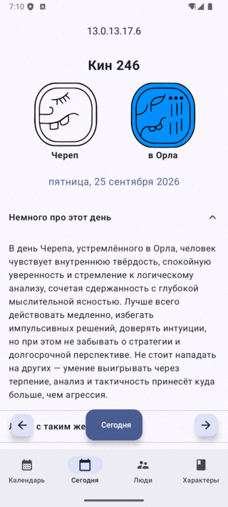
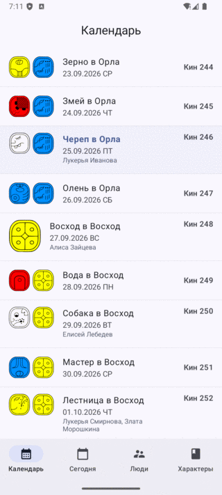
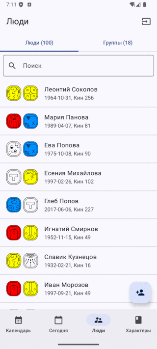
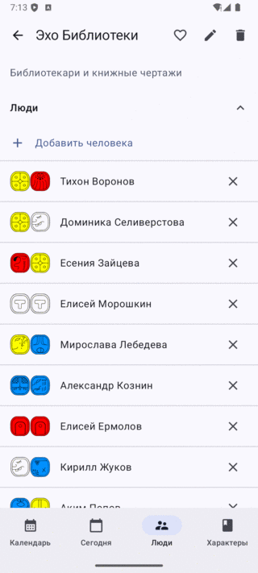
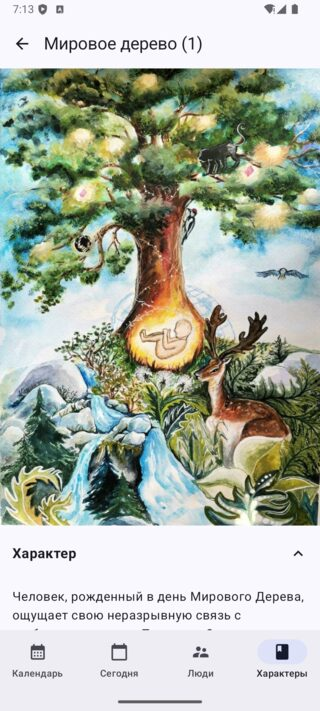

# Daysign

Android-приложение календаря майя (цолькин) — адаптированная версия священного
календаря с рядом модификаций.

Приложение считает кин дня, дневной знак и трецену, тон, длинный счёт и фантомы,
хранит базу людей с датами рождения и показывает связи между их знаками.

## Скриншоты

| Сегодня | Календарь | Люди | Группа | Характер |
|---|---|---|---|---|
|  |  |  |  |  |

Данные на скриншотах вымышленные.

## Возможности

- **Сегодня** — кин текущего дня, знаки, длинный счёт, фантомы и описание дня
- **Календарь** — бесконечная лента дней со знаками и отметками дней рождения
- **Люди** — база людей с датами рождения, их кины, профиль с возрастом в кинах
  и ближайшим майянским днём рождения
- **Группы** — объединение людей, сводка пересечений знаков по группе, круг связей
- **Характеры** — 20 дневных знаков: описание, значение символа, семь типов связей
  (поддержка, контроль, страсть, друг, тайная сила)
- **Виджет** на рабочий стол с настраиваемым фоном и составом
- Локализация: русский и английский
- Импорт и экспорт данных в JSON
- Избранное и группа по умолчанию
- Адаптивная вёрстка для телефонов и планшетов

## Сборка

Требуется Android Studio или Gradle с Android SDK.

```bash
./gradlew assembleDebug        # debug-сборка
./gradlew test                 # юнит-тесты
```

| Параметр | Значение |
|---|---|
| minSdk | 23 (Android 6.0) |
| targetSdk / compileSdk | 35 |
| JDK для демона Gradle | 21 (см. `gradle/gradle-daemon-jvm.properties`) |

### Подписанный релиз

Ключи подписи не хранятся в репозитории. Скопируйте `keystore.properties.example`
в `keystore.properties` и заполните:

```properties
storeFile=/абсолютный/путь/upload-keystore.jks
storePassword=...
keyAlias=upload
keyPassword=...
```

```bash
./gradlew assembleRelease
```

Без этого файла релизная сборка подписывается отладочным ключом — он одинаков у
всех, кто ставил Android SDK, поэтому такая сборка годится только для локальной
проверки и не подлежит публикации.

## Технологии

Kotlin, Jetpack Compose, Material 3, Navigation Compose, Room, Glance
(виджет), WorkManager, Coil, Material 3 Adaptive.

## Материалы

Все тексты приложения — описания двадцати характеров и значений двадцати знаков
(`assets/md/character/*/character_*.md` и `assets/md/character/*/symbol_*.md`),
описания кинов и тексты связей — оригинальные.

Цитаты о сотворении дней («В день Акабаль Господь увлажнил землю…», «В день Киб
Господь создал первую свечу…» и другие) приводятся по **«Книге Чилам-Балам из
Чумайеля»**, глава «Сотворение виналя» — рукопись конца XVIII века; каноническое
издание: Ralph L. Roys, *The Book of Chilam Balam of Chumayel*, Carnegie
Institution of Washington, 1933. Рукопись находится в общественном достоянии.

**Акварельные иллюстрации** (`app/src/main/res/drawable-nodpi/photo*.jpg`)
написаны художником и используются в приложении с его разрешения. Авторские
права на них принадлежат художнику, и действие GPL-3.0 на них **не
распространяется**. Любое использование этих изображений за пределами данного
приложения — включая копирование, изменение и распространение — требует
отдельного согласия правообладателя.

## Лицензия

Исходный код и тексты приложения — [GNU General Public License v3.0](LICENSE).

Акварельные иллюстрации распространяются на отдельных условиях: см. раздел
«Материалы». При форке или повторном использовании проекта учитывайте, что
свободная лицензия покрывает не всё его содержимое.
